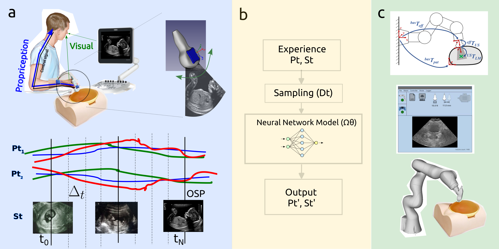

<h1 align="center">:page_facing_up: Towards a Simple Framework of Skill Transfer Learning for Robotic Ultrasound-guidance Procedures </h1>
<div align="center">

Tsz Yan Leung 2 and Miguel Xochicale 1   
1 University College London, and 2 King’s College London

</div>

[](https://arxiv.org/abs/2305.04004)

## Abstract
In this paper, we present a simple framework of skill transfer learning for robotic ultrasound-guidance procedures.
We briefly review challenges in skill transfer learning for robotic ultrasound-guidance procedures.
We then identify the need of appropriate sampling techniques, computationally efficient neural networks models that lead to the proposal of a simple framework of skill transfer learning for real-time applications in robotic ultrasound-guidance procedures.
We present pilot experiments from two participants (one experienced clinician and one non-clinician) looking for an optimal scanning plane of the four-chamber cardiac view from a fetal phantom.
We analysed ultrasound image frames, time series of texture image features and quaternions and found that the experienced clinician performed the procedure in a quicker and smoother way compared to lengthy and non-constant movements from non-clinicians.
For future work, we pointed out
the need of pruned and quantised neural network models
for real-time applications in robotic ultrasound-guidance
procedure.
The resources to reproduce this work are available at \url{https://github.com/mxochicale/rami-icra2023}.



**Figure.** (a) Ultrasound-guidance procedures: sonographer operating an ultrasound machine with fetal phantom and sensor fusion signals from inertial sensors and ultrasound imaging;
(b) Simple framework for skill transfer learning: collecting experience with sensors ($Pt_n$ pose and $St$ Signal), sampling method for fusion sensor ($\Delta_t$), and identified the need of computational efficient neural network model ($\Omega_\theta$), and output for high-dimensional model \cite{deng2021}, and 
(c) Robotic ultrasound-guidance procedures: transformations, graphical user interface and simulation using robotic US-guidance light-weight 7 degrees-of-freedom robot (KUKA LBR Med 7) \cite{Gerlach2022, Ipsen2021}.

## Robot-Assisted Medical Imaging (RAMI) ICRA workshop 2023 [:link:](https://sites.google.com/view/rami-icra-2023-workshop/home)
Important dates:   
 * Abstract Submission Deadline: 15th March 2023， 24th March 2023 
 * Author Notification: 1st April 2023 
 * Workshop Date: 29th May 2023

## Clone repository
* Generate your SSH keys as suggested [here](https://docs.github.com/en/github/authenticating-to-github/generating-a-new-ssh-key-and-adding-it-to-the-ssh-agent) (or [here](https://github.com/mxochicale/tools/blob/main/github/SSH.md))
* Clone the repository by typing (or copying) the following line in a terminal at your selected path in your machine:
```
cd && mkdir -p $HOME/repositories/mxochicale && cd  $HOME/repositories/mxochicale
git clone git@github.com:mxochicale/rami-icra2023.git
```

## Citations
BibTeX to cite
```
@misc{leung-xochicale-rami-icra2023,
      author={
            Tsz Yan Leung and 
            Miguel Xochicale},
      title={
            Towards a Simple Framework of Skill Transfer Learning for 
            Robotic Ultrasound-guidance Procedures}, 
      year={2023},
      eprint={2305.04004},
      archivePrefix={arXiv},
      primaryClass={cs.RO}
}
``` 

## Contributors
Thanks goes to all these people ([emoji key](https://allcontributors.org/docs/en/emoji-key)):  
<!-- ALL-CONTRIBUTORS-LIST:START - Do not remove or modify this section -->
<!-- prettier-ignore-start -->
<!-- markdownlint-disable -->
<table>
  <tr>
    <td align="center"><a href="https://github.com/Goosie-L"><br /><sub><b> Goosie Leung </b></sub>        </a><br /><a href="https://github.com/mxochicale/rami-icra2023/commits?author=Goosie-L" title="Code and Research">  💻 🤔 🔧   </a></td>
    <td align="center"><a href="https://github.com/mxochicale"><br /><sub><b>Miguel Xochicale</b></sub>           </a><br /><a href="https://github.com/mxochicale/rami-icra2023/commits?author=mxochicale" title="Code and Research">💻 🔬 🤔 🔧 </a> <a href="https://github.com/budai4medtech/midl2023/commits?author=mxochicale" title="Documentation">📖 🔧 </a></td>
  </tr>
</table>
<!-- markdownlint-restore -->
<!-- prettier-ignore-end -->

<!-- ALL-CONTRIBUTORS-LIST:END -->

This work follows the [all-contributors](https://github.com/all-contributors/all-contributors) specification.  
Contributions of any kind welcome!